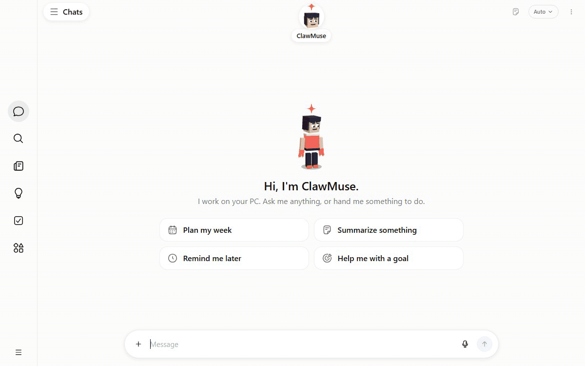
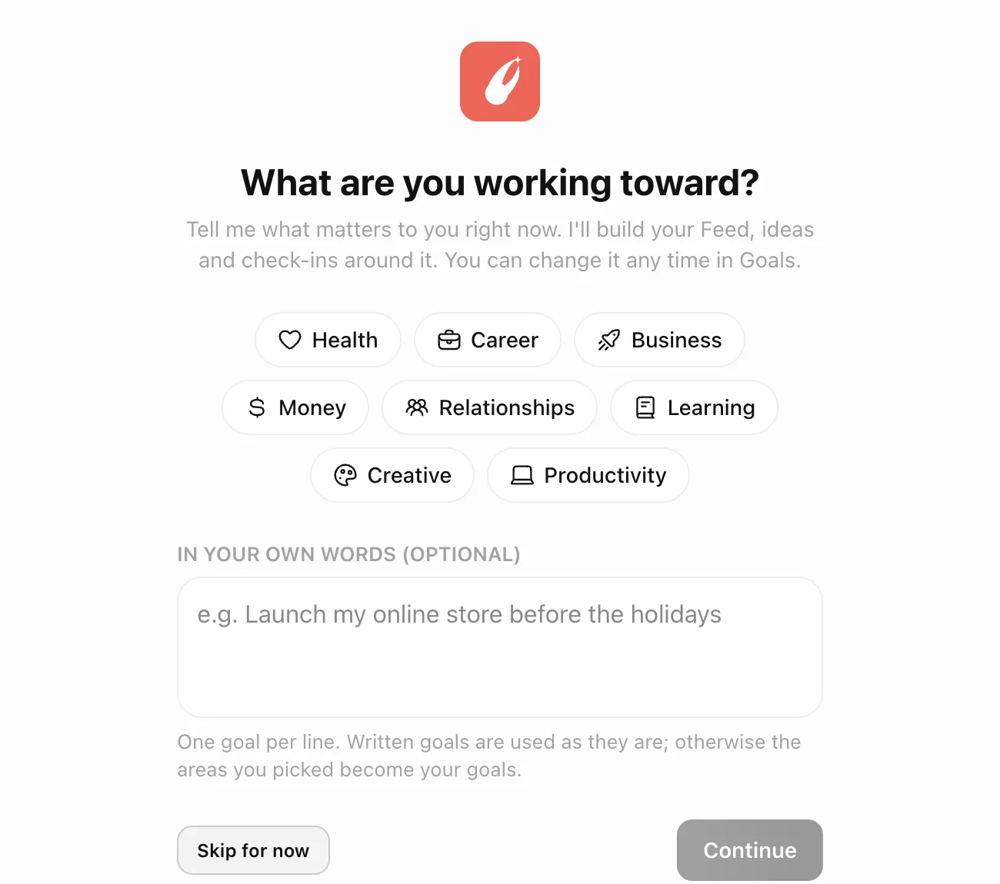
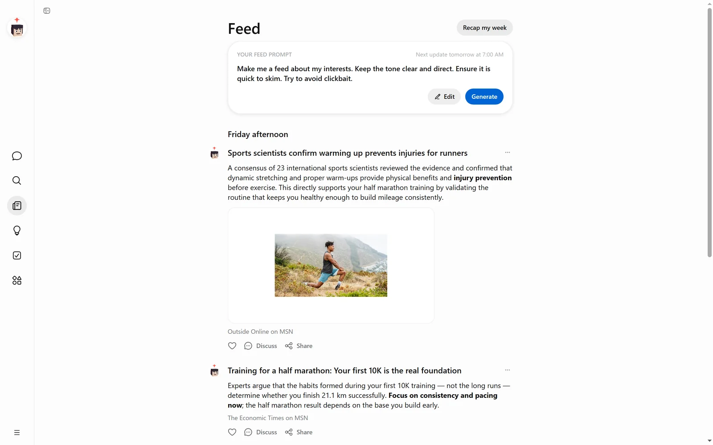
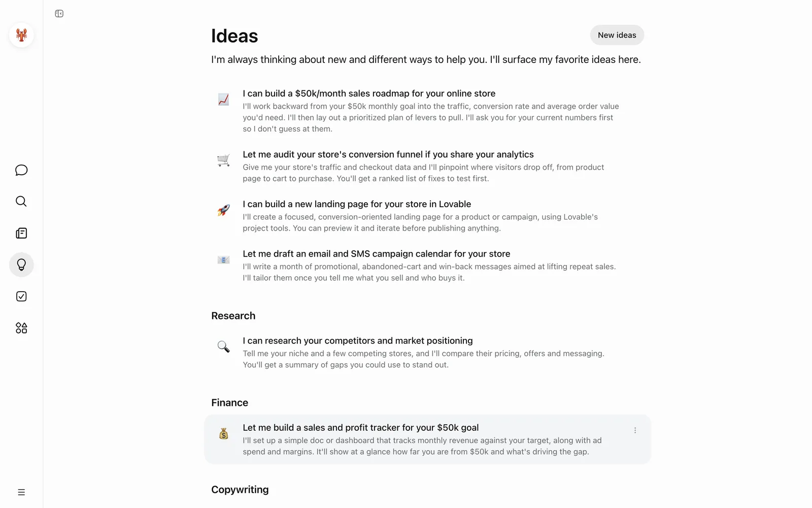
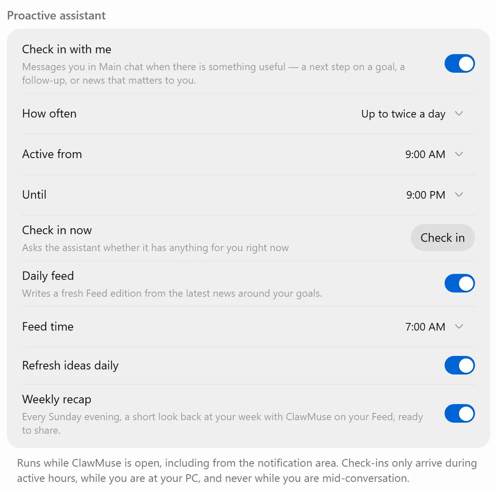
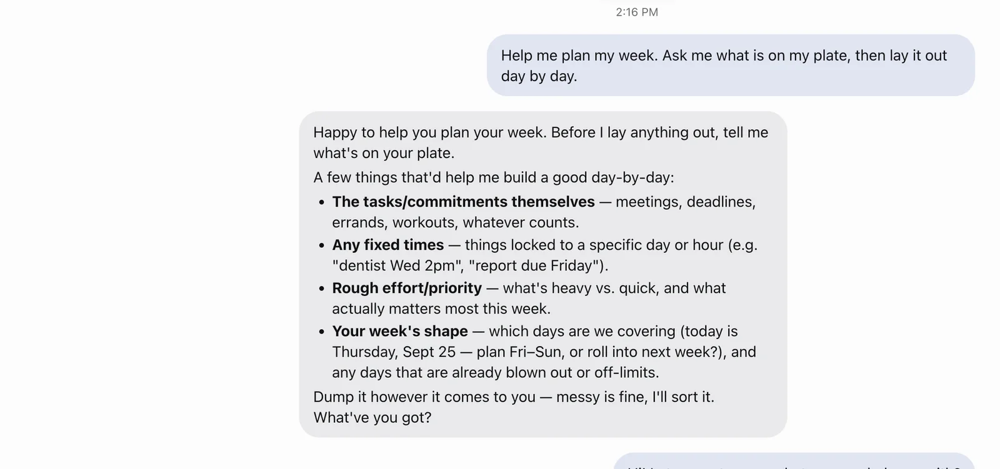
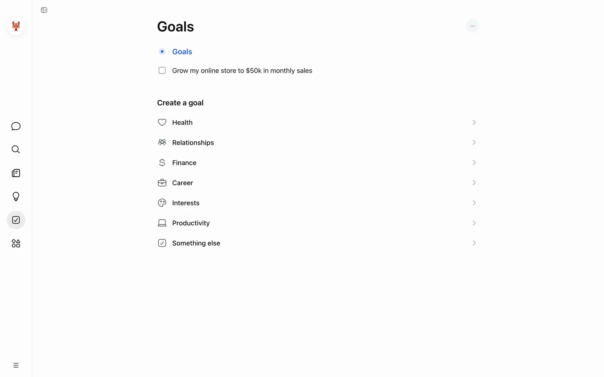

<p align="center">
  
</p>

<h1 align="center">ClawMuse</h1>

<p align="center">
  <strong>Your personal AI, on your own computer.</strong><br>
  A free desktop assistant for macOS and Windows. It follows the news around your goals, suggests
  what to do next, and does the work with the files and tools on your machine, using the models
  you already have.<br>
  No account. No ClawMuse server. No analytics.
</p>

<p align="center">
  <a href="https://github.com/PSA-Team-source/clawmuse/actions/workflows/ci.yml"></a>
  <a href="https://github.com/PSA-Team-source/clawmuse/releases/latest"></a>
  <a href="LICENSE"></a>
  
  <a href="https://github.com/openclaw/openclaw"></a>
</p>

<p align="center">
  <a href="https://clawmuse.app/download/mac-arm64"></a>
  <a href="https://clawmuse.app/download/windows-x64"></a>
  <br>
  <sub><a href="https://clawmuse.app/download/mac-x64">Mac (Intel)</a> · <a href="https://clawmuse.app/download/windows-arm64">Windows on ARM</a> · <a href="https://github.com/PSA-Team-source/clawmuse/releases">All releases and checksums</a></sub>
</p>

<p align="center">
  
</p>

<p align="center">
  ⭐ <strong>If ClawMuse is useful, a star helps others find it.</strong>
</p>

---

## Why ClawMuse

- **Local-first.** The app and the agent runtime run on your computer. Your chats, goals, Feed,
  skills and settings are files in one folder you can open, back up or delete.
- **Your own models.** Use the Claude Code sign-in already on your computer, your own Anthropic,
  OpenAI, OpenRouter, OpenCode Zen or Z.ai key, or a local model through
  [Ollama](https://ollama.com) or [LM Studio](https://lmstudio.ai). On first launch it looks for a
  credential this computer already has and tells you which file it found it in before using it.
- **Free and open.** MIT licensed, no subscription, no ClawMuse account. You pay your model provider
  directly, or nothing if the model runs locally.
- **It does things.** Not only answers: it reads and writes files, runs commands, drives a managed
  browser, runs skills and scheduled tasks, and asks before anything irreversible.

| | ClawMuse |
|---|---|
| Where it runs | On your Mac or PC: an Electron app plus a local [OpenClaw](https://github.com/openclaw/openclaw) gateway |
| Account | None |
| Model | Yours: Claude Code, an API key, or a local model |
| Where your data lives | `~/.openclaw-clawmuse` on your computer |
| Telemetry in the app | None: no analytics, no crash reporting |
| Price | Free (MIT) |
| What it can act on | Files, shell, a managed browser, skills, scheduled tasks, MCP connectors, with approvals |

## What it does

<table>
<tr>
<td width="50%"></td>
<td width="50%"></td>
</tr>
<tr>
<td valign="top"><strong>Goals first.</strong> One question on first launch: what are you working toward?
The Feed, the Ideas and the moments it speaks up are all shaped by the answer. Change your goals
any time.</td>
<td valign="top"><strong>A daily Feed.</strong> A short edition of real news around your goals, each
story with its sources and picture. Set the time it arrives, write your own Feed prompt, discuss
any story in chat.</td>
</tr>
<tr>
<td width="50%"></td>
<td width="50%"></td>
</tr>
<tr>
<td valign="top"><strong>Ideas it can carry out.</strong> Concrete next steps written for your
situation, such as a roadmap, a competitor scan or a tracker. One click starts one.</td>
<td valign="top"><strong>Check-ins that respect you.</strong> It messages first only when it has
something specific, up to the frequency you choose, within your hours, and never mid-conversation.</td>
</tr>
<tr>
<td width="50%"></td>
<td width="50%"></td>
</tr>
<tr>
<td valign="top"><strong>Chat that gets things done.</strong> It researches, writes, plans and keeps
track with the files, shell and managed browser on your computer. Quick Chat opens from anywhere
with <kbd>Alt</kbd>+<kbd>Space</kbd>, and you can dictate instead of typing.</td>
<td valign="top"><strong>Goals you can see.</strong> Your goals in one place: add them in your own words
or from a starter pack, tick them off, and ClawMuse keeps its Feed and Ideas pointed at them.</td>
</tr>
</table>

And:

- **Weekly Recap.** Every Sunday evening, a short look back at your week with ClawMuse at the top
  of the Feed. It only states numbers the app actually recorded.
- **A ClawMuse avatar that reacts.** A 3D character that shows when it is thinking, talking or
  working. Ask it to change its look and it restyles itself.
- **Share cards and clips.** Turn a Feed story, an idea, an answer or your Weekly Recap into an
  image card, or a short clip of the avatar celebrating beside it.
- **Skills and routines.** Write or edit skills (`SKILL.md`) in the built-in studio. Anything done
  more than once can become a scheduled task that reports back into the same conversation.
- **Teach a task.** Record your own browsing; a bot turns the trail into a draft skill you review
  before it goes live.
- **Approvals.** A bot stops and asks before anything irreversible. Per-bot tool limits are
  enforced by the runtime.
- **Channels.** Reach your assistant from Telegram or Discord as well as the app.

## Install

**macOS** — paste into Terminal:

```sh
curl -fsSL https://clawmuse.app/install.sh | sh
```

It downloads the latest release for your Mac from this repository's
[Releases page](https://github.com/PSA-Team-source/clawmuse/releases), checks it against that
release's `SHA256SUMS.txt`, installs ClawMuse in Applications and opens it — with no security
prompt. Run it again at any time to update. The script is
[`scripts/install-mac.sh`](scripts/install-mac.sh); read it first if you like.

Or download an installer:

| Platform | Download |
|---|---|
| macOS 12+, Apple silicon (M1 and later) | [ClawMuse for Mac (Apple silicon)](https://clawmuse.app/download/mac-arm64) |
| macOS 12+, Intel | [ClawMuse for Mac (Intel)](https://clawmuse.app/download/mac-x64) |
| Windows 10/11, x64 | [ClawMuse for Windows (x64)](https://clawmuse.app/download/windows-x64) |
| Windows 10/11, ARM64 | [ClawMuse for Windows on ARM](https://clawmuse.app/download/windows-arm64) |

Every release is also on the [Releases page](https://github.com/PSA-Team-source/clawmuse/releases)
with a `SHA256SUMS.txt`. To check a download: `shasum -a 256 <file>` on macOS,
`Get-FileHash <file>` in PowerShell, and compare with the line in `SHA256SUMS.txt`.

**First open of a downloaded installer.** The builds are not code-signed yet (no Apple Developer
ID or Windows code-signing certificate), so the operating system asks you to confirm once:

- **macOS**: when macOS says *"ClawMuse" Not Opened — Apple could not verify…*, click **Done**,
  open *System Settings → Privacy & Security*, scroll down and click **Open Anyway** next to
  ClawMuse, then confirm. (Right-click → Open no longer does this on macOS 15 and later.)
- **Windows**: if SmartScreen appears, click **More info → Run anyway**. The installer is per-user
  and needs no administrator rights.

After that it opens like any other app.

<details>
<summary><strong>What happens on first launch</strong></summary>

The [OpenClaw](https://github.com/openclaw/openclaw) runtime ClawMuse runs on (a pinned release)
ships inside the installer, already installed for your platform, and the first launch unpacks it
with no network. Only if that fails does the app download it instead, using the Node.js built into
the app and an npm that ships inside it. No Node, Homebrew or terminal is needed on your side.
Then it looks for a model you already have and offers it with one button, and asks what you are
working toward.
</details>

## How it works

ClawMuse is an Electron app that drives a local [OpenClaw](https://docs.openclaw.ai) gateway. It
does not reimplement the agent runtime: it installs a pinned `openclaw` CLI into a private prefix,
writes the gateway configuration, and talks to the gateway over a loopback WebSocket.

```
 ┌──────────────────────── ClawMuse (Electron) ────────────────────────┐
 │  renderer  React 19 · Zustand · TanStack Query · three.js           │
 │     │  window.clawmuse.*  (contextBridge; typed in src/shared/ipc)  │
 │  preload                                                            │
 │     │  ipcMain                                                      │
 │  main      runtime manager · built-in assistant (Feed, Ideas,       │
 │            check-ins, recap) · secure store (OS keychain) · tray ·  │
 │            shortcuts · notifications · deep links (clawmuse://)     │
 └─────┬───────────────────────────────────────────────────────────────┘
       │  ws://127.0.0.1:<port>  (gateway token + Ed25519 device identity)
       ▼
 openclaw gateway   profile "clawmuse", state in ~/.openclaw-clawmuse
   macOS:   a launchd LaunchAgent, so agents keep working after you quit the app
   Windows: `openclaw gateway run`, supervised by the app with restart backoff
       ├── agents     one per bot: own memory, instructions and tool limits
       ├── cron       scheduled tasks
       ├── skills     SKILL.md files
       └── tools      files, shell (exec), a managed browser profile, MCP connectors
```

<details>
<summary><strong>Where things live</strong></summary>

| Concept | Where it lives |
|---|---|
| A bot | an OpenClaw agent in `agents.list[]` of `~/.openclaw-clawmuse/openclaw.json` |
| Its guidelines | `AGENTS.md` in the bot's private workspace, `~/.openclaw-clawmuse/bots/<id>` |
| Memory, auth, transcripts | its own `agentDir`, `~/.openclaw-clawmuse/agents/<id>` |
| What it may do | a per-agent `tools.deny` list, enforced by the gateway |
| Provider keys | `~/.openclaw-clawmuse/.env` (never inside the app bundle) |
| App secrets | encrypted with Electron `safeStorage` (the macOS Keychain, DPAPI on Windows) |

| Path | Contents |
|---|---|
| `src/main` | Electron main process; `services/local-runtime` installs, configures and supervises the gateway |
| `src/preload` | the `window.clawmuse` bridge |
| `src/renderer` | the React UI (`routes/`, `features/`, `stores/`, `design/`) |
| `src/shared` | the IPC contract shared by main and renderer ([`docs/IPC.md`](docs/IPC.md)) |
| `native` | the macOS key monitor used by push-to-talk (Swift, built by `scripts/build-native.mjs`) |
| `scripts` | packaging hooks, smoke and end-to-end tests |
</details>

## Privacy: what leaves your machine

1. **Your messages go to the model provider you chose**, under your own key and their terms, and
   so does dictated audio when you use dictation. If the model runs locally, nothing leaves.
2. **When a bot browses or calls a connector**, it reaches that site the way your browser would.
3. **The Feed looks up headlines**: short search terms drawn from your goals go to Bing News
   (Google News as the fallback), and story pictures load from where the source hosts them.
4. **Release builds check GitHub Releases for updates**, 30 seconds after launch and then every
   six hours. Builds from source do not check.
5. **The OpenClaw runtime ships in the installer.** Only if unpacking it fails does first launch
   download it from the npm registry, at the same pinned version.

There is no analytics and no crash reporting. Deleting `~/.openclaw-clawmuse` deletes everything,
and *Settings → Data controls → Remove ClawMuse* does that for you.

**Limits, stated plainly.** The agents run on your real machine: approvals and per-bot tool limits
are real, but a bot with file and shell access has file and shell access, so give each bot the
narrowest permissions that let it do its job. An approval covers the action being proposed; there
is no undo for what is already done. Teach a task records a trail of pages, not clicks, and the
draft skill says what it inferred.

## Build from source

Requirements: **Node.js 22** and npm. Development, tests and `npm run build` work on macOS,
Windows and Linux. Packaging the Mac app needs a Mac (the Command Line Tools are enough; Xcode 26
adds the layered macOS 26 icon). The release workflow builds the Windows installers on Windows
runners.

```bash
git clone https://github.com/PSA-Team-source/clawmuse.git
cd clawmuse
npm ci

npm run dev           # run the app with hot reload
npm run typecheck     # TypeScript, main and renderer
npm run lint          # ESLint
npm test              # Vitest unit tests
npm run build         # production bundle in out/
```

Packaging:

```bash
npm run pack:dir      # unpacked app in dist/ (fastest way to try a packaged build)
npm run dist:mac      # DMG + ZIP, arm64 and x64
npm run dist:win      # NSIS installers, x64 and arm64
```

A build without a Developer ID is ad-hoc signed by `scripts/after-sign.mjs`, so it opens through
**Open Anyway** instead of being reported as damaged. Signed and notarized releases are produced by
the [release workflow](.github/workflows/release.yml); see [CONTRIBUTING.md](CONTRIBUTING.md#releasing).

## Roadmap

Near-term, and tracked in the open:

- **Signed builds.** An Apple Developer ID with notarization, and a Windows code-signing
  certificate, so the first-open confirmation goes away. The release workflow already signs when
  the certificates are configured ([signing secrets](CONTRIBUTING.md#signing-secrets)); the certificates
  are what is missing.
- **Updates in place.** The app already checks GitHub Releases for a newer version. Releases built
  by the release workflow attach the update manifests it reads; on macOS, installing an update in
  place also needs the signed build above.
- **Linux.** Development already runs on Linux; packaging does not yet. What blocks it is listed in
  [#15](https://github.com/PSA-Team-source/clawmuse/issues/15) and
  [#14](https://github.com/PSA-Team-source/clawmuse/issues/14). Help wanted.

## Contributing

Issues and pull requests are welcome, and there are
[good first issues](https://github.com/PSA-Team-source/clawmuse/labels/good%20first%20issue) with
file pointers and acceptance criteria. Read [CONTRIBUTING.md](CONTRIBUTING.md) first, ask questions
in [Discussions](https://github.com/PSA-Team-source/clawmuse/discussions), and report security
problems privately as described in [SECURITY.md](SECURITY.md). Everyone taking part is expected to
follow the [Code of Conduct](CODE_OF_CONDUCT.md).

## Licence

MIT, see [LICENSE](LICENSE).

## Acknowledgements

ClawMuse is built on [OpenClaw](https://github.com/openclaw/openclaw) (MIT), which provides the
agent runtime: the gateway, agents, tools, skills, cron and channels. ClawMuse is the desktop app
around it. It also stands on [Electron](https://www.electronjs.org), [React](https://react.dev),
[three.js](https://threejs.org) and the other open-source packages listed in
[`package.json`](package.json).
